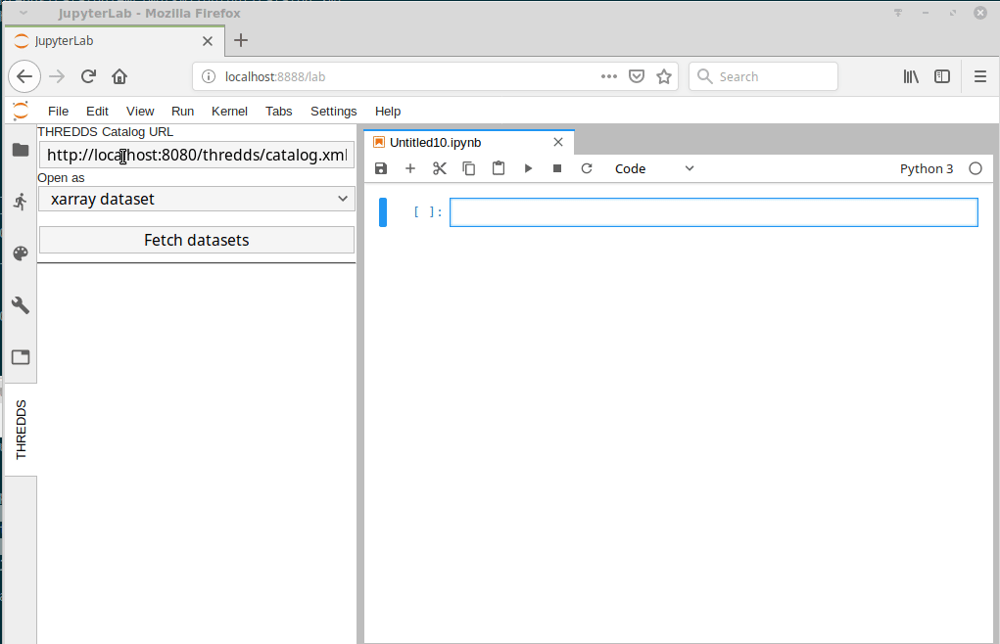

# jupyterlab_thredds

JupyterLab dataset browser for [THREDDS catalog](https://www.unidata.ucar.edu/software/thredds/v4.6/tds/catalog/index.html)

Can inject iris/xarray/leaflet code cells into a Python notebook of a selected dataset to further proces/visualize the dataset.



## Prerequisites

* JupyterLab
* ipywidgets, `jupyter labextension install @jupyter-widgets/jupyterlab-manager`
* ipyleaflet, `jupyter labextension install jupyter-leaflet`
* iris, http://scitools.org.uk/iris/docs/latest/index.html, `conda install -c conda-forge iris`

## Installation

Not released yet, must use development instructions to install.

```bash
pip install jupyterlab_thredds
jupyter labextension install jupyterlab_thredds
```

## Development

For a development install (requires npm version 4 or later), do the following in the repository directory:

```bash
npm install
npm run build
jupyter labextension link .
python setup.py develop
jupyter serverextension enable --sys-prefix jupyterlab_thredds
```

To rebuild the package and the JupyterLab app:

```bash
npm run build
jupyter lab build
```

Watch mode
```bash
# shell 1
npm run watch
# shell 2
jupyter lab --ip=0.0.0.0 --no-browser --watch
```

## Usage

1. In Jupyter lab open a notebook
2. Open the `THREDDS` tab on the left side.
3. File the catalog url
4. Press search button
5. Press a dataset to insert code into a notebook
